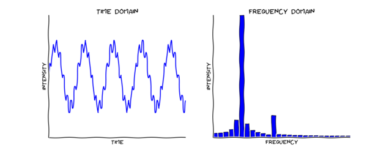
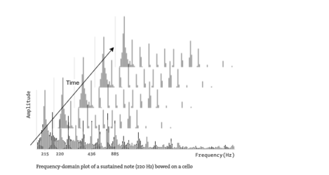
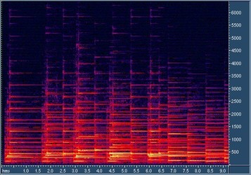
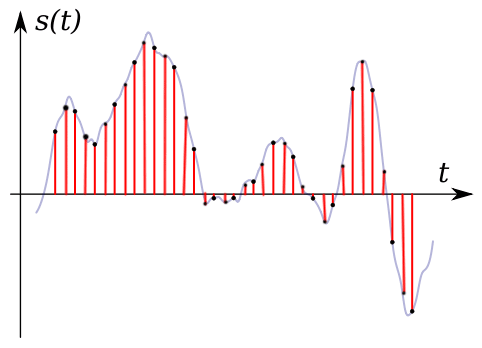

# TensorFlow Signal Processing

##### Joel Shapiro

# Problem Overview

The objective of this project is to evaluate the effectiveness of doing audio effect emulation using deep learning. For audio, there are two main classifications of tools: generators and effects. A generator is something which takes non-audio input, either physical or midi, and creates audio out of it. This would include instruments, synthesizers, drums - basically anything that really stands out as being traditionally musical. The other category, effects, are elements which take audio as input and transform it into some other audio to output. This can range from a simple filter to more complex effects such as distortion or reverb; even the echo of a room or quality drop over a phone call is an effect. The idea behind this project is to see if we can train a network to emulate one of these effects using deep learning.  
Audio is an interesting medium for machine learning. Like image data, the output can be judged both quantitatively and qualitatively. On top of this, audio itself has a complex structure. The additive property of waves can cause some unforeseen outcomes. On top of that, digital audio data is inherently convoluted: it is stored as a time series of points which are sampled from the audio signal itself. These points are fast Fourier transformed back into the signal whenever the audio is ready to be output. Because of this, a lot of the information which is affected by effects is hidden behind this signal processing problem.*  
In the past, doing signal processing in machine learning involved doing some manual decomposition of the input in order to abstract away the signal processing [1]. Often audio would be rendered into images of the spectrogram, which show the frequency distribution of the audio. While this works fine for classification problems, it seems unnecessary for an end to end problem like the one this paper is focused on. For that, we need to do actual signal processing in order to detect the features that matter.  

*note that a lot of effects can be done as transformations are done as an application to an untransformed wave, but it's often the case that the effect is easier when done in the frequency space.  

The current progress on this project is available at [github.com/jshap70/TensorFlow-Signal-Processing](http://github.com/jshap70/TensorFlow-Signal-Processing)  
The audio files and results can be seen [here](https://github.com/jshap70/TensorFlow-Signal-Processing/tree/master/sound_files), though the relevant ones are linked as needed in the paper.


## Sample Types

Previously I mentioned how audio is a conceptually complex structure. This is because audio data is time series data of the amplitude of the audio, however almost all of the information that we think of as being "stored" as sound is stored in the frequency space of the sound. The relationship between the two is extracted by using a Fourier transform. An example can be seen below, where the time series data on the left would produce the frequency chart on the right.  

[2]

However, this is an oversimplification. In reality, the frequency chart is adding a dimension to the data, so represnting it in 2D space means that the frequency chart above is only true for a small time cross section of the audio. A real frequency distribution of the sound would look as such.  
 
[3]

And in fact this is what most machine learning uses to train audio on, except instead of having a height in the amplitude dimension they use the image's color channels and color intensity to represent it. This type of representation is called a Spectrogram. Spectrograms actually store 3 dimensional data, with frequency shown in the vertical direction, amplitude shown as color intensity, and time shown along the horizontal axis. You can see an example below.  

[4]

That is why the goal of this project is to attempt to have the network learn the frequency-amplitude relationship on it's own, so that we can skip the step which manually extracts the important features.  
Digital audio data is stored as sampled points from the amplitude vs time graph, which is to be expected given that it's the direct form -albeit with a Fourier transform- that the output needs to be. A basic example can be seen below.  

[5] 

The audio used in this project has a uniform sample rate, which allows us to batch it easier.  


# The Network

The plan to teach the network how to interpret the audio data needed to address 2 main concerns: first, it needed to be able to look at the audio and extract frequency data from it, and second it needed to be able to "undo" this operation so that the data could be converted back into audio.  
As far as the first problem is concerned, it's possible for us to add time as a dimension to the audio data similar to the frequency spectrogram concept above. In that model, time is represented as part of the image by being one of it's axis. In this way, the 2 dimensional instantaneous frequency plot becomes a 3 dimensional image. For our data, we have a 1 dimension of data: amplitude. By adding time as a dimension to this data, by batching it in contiguous time chunks, we can attempt to expose the network to patterns in the data. Or at least that's the idea.  
The second major issue deals with making the system end-to-end. We are looking to be able to take the output of the network, write it to a file, and play it back without having to take any extra steps. For a linear or nonlinear network, this isn't really an issue. At any point they should just natively be able to transform the result to a readable format. However, for a convolutional network which is introducing extra depth in the network, it's necessary to have a convolutional transpose layer. This type of layer is sometimes referred to as a 'deconvolutional' layer, however it's important to note that this is actually a misnomer, as deconvolution is a completely different process which is used in computer vision. Regardless of the terminology, a convolutional transpose layer allows you to take layers which have been convolved and attempts to transform the data back into more meaningful data. In our case, it changes the output back into the amplitude graph. The cool thing about convolutional transform layers is that we can reuse the exact same filter variables from our original convolutional layer in the transform layer. This significantly lessens the training difficulty of the network. 
With this in mind, we'll move on to the main design.

## Layer Design
Intuitively, it would make sense that a linear network would most likely not be able to properly model this problem. The data is probably too complex for a linear model to interpret it. However, I still wanted to form a baseline to see just what kind of benefit we would achieve by moving to a more advanced network.  
So to start, I used a standard fully connected linear regression neural network, varying the depth of the hidden layer to find something that seemed reasonable to train. The goal of this network was to try to overfit the training data to show that it can at least be brute forced. With the standard training set I was using, these networks were taking upwards of 4,000 epochs to train.  
Moving past the basic networks, it seems somewhat intuitive that this problem would be decently well represented by a convolutional network because of it's ability to attempt to train filters on sections of the data. If these filters are large enough to detect full oscillations, it may be able to extract some relevant frequency data. As mentioned previously, any time we use a convolutional layer we will have to use a convolutional transpose layer on the output. The cool thing about convolutional transform layers is that we can reuse the exact same filter variables from our original convolutional layer in the transform layer, which will significantly lessens the training difficulty of the network.  
So currently we've built up a system which should be able to look at the data in a fashion which is potentially more true to the frequency space of the data. Now, all we need to do to finish off this basic setup is to place a fully connected layer in between the convolution and convolutional transpose layer  

## Sampling and Batching

Looking at the data itself, the wav files are stereo 16bit PCM (integer)) files. To begin with, I converted the data to a 32bit float wav file and normalized the audio to fit within that standard. I split apart each file into mono tracks because it allows for us to experiment with different network designs a lot faster. However, there are filters which have different effects across stereo channels, so we will lose the ability to train on those for now.  
The audio we are training on is a set of sine, square, and saw waves which travel through a range of requencies. Although these waves are very basic, the idea is that the simpler wave shapes might help to train the network to understand frequency analyis easier. The validation data is extracted from the same dataset as the training, but the testing data is entirely different. It uses the same filter, but it is a recording of a piano being played through it. The idea is that this is a much more complex wave shape, so it will be a better test of the network.  

Because it is time series data, the batching process is a bit trickier. Although the data needs to be kept in contiguous chunks, we can still extract the smaller sections of it to train independently on to ensure the network is trained uniformly. To do this, I implemented a batching system that does a scrolling window selection of the audio for discrete time periods, and then I shuffle those batches for every epoch. If we set the offset of each window to the one next to it is smaller than the length of each window, then we can get some overlap in the windows to further increase the number of available batches.  

*Side note: It might seem at first that we would want to take cuts of the data at small enough intervals to only allow for a handful of oscillations in the data. This might ensure that the net would get as close as possible of an idea of the instantaneous frequency data. But in reality this wont work. The issue is that the length of an oscillation is directly the result of pitch, so if the pitch changes the window might then cut off parts which are needed to extract the data. This is another reason why we must rely on the convolutional filters to slice the data for us.  

## Training data

The training data this project is mostly composed of some simple, generated audio samples which covers varying types of sound and pitches. On the more simple side, we have sine, square, and saw waves that move through a frequency range. Starting off I just use a lowpass (cuts off high frequencies) effect as the filter, but later I used a more complex effect made with some pedal effects. Unfortunately I have not had enough time to do very in depth testing with the later yet, so this paper will not be able to cover it.  
An example of the lowpass training data can be heard here:  
input: [](https://rawcdn.githack.com/jshap70/TensorFlow-Signal-Processing/master/sound_files/lowpass%20-%20pre%20-%20square.wav)  
output: [](https://rawcdn.githack.com/jshap70/TensorFlow-Signal-Processing/master/sound_files/lowpass%20-%20post%20-%20square.wav)


# Results

Before we look at the various netwroks themselves, lets look at the expected input and output.  
input: [](https://rawcdn.githack.com/jshap70/TensorFlow-Signal-Processing/master/sound_files/lowpass%20-%20pre%20-%20beethoven_opus10_1.wav?raw=true)  
expected output: [](https://rawcdn.githack.com/jshap70/TensorFlow-Signal-Processing/master/sound_files/lowpass%20-%20post%20-%20beethoven_opus10_1.wav?raw=true)  

*Side note: the testing outputs have a slight 'tick' to them around every half a second. This is a result of my hackish batching system for testing. Esentially it's just the padding on the convolution reseting the audio data to 0.0 at the edges of the batches, so the audio clicks as the output snaps abruptly to this value. Given time, I could have written one that used a sliding window system similar to the training data and eliminated this noise.  

## Linear Regression

First up, the results of the linear network.  

Based on trail and error, I found the linear network converged best when the hidden layer had around 1000 nodes, which posed a number of issues. The largest of which was that it took almost 5 hours to train this network, and that was while I was hogging as much of the math department's server as I could.  
After after setting up the network, I ran it and got the following output after training it a little bit.  

Predicted Output of Linear Network @ 20 epochs: [](https://rawcdn.githack.com/jshap70/TensorFlow-Signal-Processing/master/sound_files/out/linear_epoch=20_beethoven_opus10_generated.wav?raw=true)  

Huh, strangly it's just white noise. Maybe we just need to train it more. 

Predicted Output of Linear Network @ 4000 epochs: [](https://rawcdn.githack.com/jshap70/TensorFlow-Signal-Processing/master/sound_files/out/linear_epoch=4000_beethoven_opus10_generated.wav?raw=true)

Well, it at least sounds like audio now. However, it only really sounds like the training data; nothing from the testing data is really retained at all. Lets look at some of the numbers behind it and see if that tells us why it's as bad as it though bad.

```python
x, y, P, MSE, sess = run_lin(1000, 4000)
run_test(x, y, P, MSE, sess, run_name='best_linear')

  starting from epoch: 4000

                  mse                    rmse                                 std
 training  validation    training  validation    training  validation   reference
  0.00342     0.00327     0.05847     0.05722     0.05885     0.05723     0.10412

  test mse: 0.00118764
  test rmse: 0.0344621
  test std: 0.0344703680322
```

Surprisingly, the training and validation mse's are higher than the testing ones. Given how much the testing output sounds like the training set, you would expect it to be larger than the training because of overtraining. This is one of the first indications that MSE may not be the best judge of accuracy for this problem, but more on that later.  

Interestingly   


# Thoughs

Why is MSE a bad judge of quality:


## Future Plans

// maybe we could do multiple filter sizes together? 

// once we've trained the convolutional layers responsible for converting to and from raw audio data, maybe re-use them to train on another filter so we can focus more on training the middle layers

// RNN’s and how they might help with time series data and maybe allow us to get rid of the sliding window batching


### Notes / Sources

[1] At least this is true for most practical applications. An example can be seen here: [github.com/markostam/audio-deepdream-tf](https://github.com/markostam/audio-deepdream-tf)

[2] Image showing the relationship between time series and frequency data. Source: [learn.adafruit.com/fft-fun-with-fourier-transforms/background](https://learn.adafruit.com/fft-fun-with-fourier-transforms/background)

[3] This image is heavily modified from the source, but still it originally came from: [processing.org/tutorials/sound/](https://processing.org/tutorials/sound/)

[4] Spectrogram image from: [dwutygodnik.com/artykul/673-uwaznosc-fraktale-spektra-modele.html](http://www.dwutygodnik.com/artykul/673-uwaznosc-fraktale-spektra-modele.html)

[5] Image showing how digital audio data is stored. Source: [progulator.com/digital-audio/sampling-and-bit-depth/](http://progulator.com/digital-audio/sampling-and-bit-depth/) However, note that there are some very large errors in this article. Most importantly, it incorrectly does not cover how Fourier transforms are used to go from the digital point sampling back to the analog signal and makes the common fault of believing the data is just directly interpreted as an averaging operation. 


[misc]  
some audio midi from - http://www.piano-midi.de/brahms.htm  
wavio - https://github.com/mgeier/python-audio/ - by Warren Weckesser